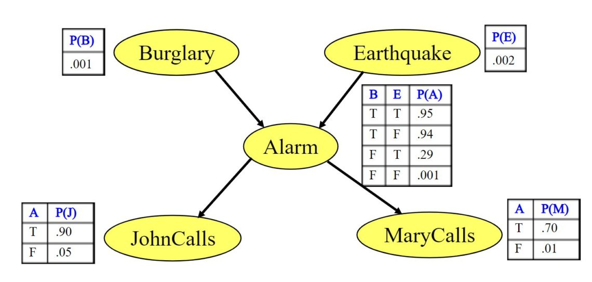

Bayesian Network Builder - Probabilistic Programming made Easy
=====

# Random Variables
```scala
import com.sap.bnb.bn._
val bool = Flip(.6)
println(bool)
```

```
false->.40, true->.60
```

```scala
import com.sap.bnb.bn._
val categorical = Cards("male" -> .5,"female" -> .5)

```

# Bayesian Networks

A [Bayesian Belief Network](https://en.wikipedia.org/wiki/Bayesian_network) (BBN), or simply Bayesian Network, is a statistical model used to describe the [conditional dependencies](https://en.wikipedia.org/wiki/Conditional_dependence) between different random variables.

# Burglary Example
I'm at work, neighbor John calls to say my alarm is ringing, but
neighbor Mary doesn't call. Sometimes the alarm is set off by
minor earthquakes. Both burglary and earthquake are rather rare events.

The question we want to answer: _**Is there really a burglar at home?**_

Considering that:

- John always calls when he hears the alarm, but sometimes
  confuses the telephone ringing with the alarm.

- Mary likes rather loud music and sometimes misses the alarm. 


```scala
import com.sap.bnb.bn._
import com.sap.bnb.dsl._

val graph = druid {
 "burglar" <~ Flip(.001)
 "earthquake" <~ Flip(.002)
 "alarm" <~ ("burglar", "earthquake",
     (true, true) -> Flip(.95),
     (true, false) -> Flip(.94),
     (false, true) -> Flip(.29),
     (false, false) -> Flip(.001))
  "alarm" ~ (true -> Flip(.9), false -> Flip(.05)) ~> "JohnCalls"
  "alarm" ~ (true -> Flip(.7), false -> Flip(.01)) ~> "MaryCalls"
}
val burglar = graph.evidences("JohnCalls" -> true, "MaryCalls" -> false)
      .solve("burglar").value.get
println(s"posterior: $burglar")
println("chances burglary: " + f"${burglar.chances(true) * 100}%2.1f%%")
```

```
posterior: true -> .005, false -> .995
chances burglary: 0,6%
```

# Dynamic Bayesian Networks

```scala
import com.sap.bnb.bn._
import com.sap.bnb.dsl._
  val day1 = druid {
    "high humidity" ~ (true -> Flip(.7), false -> Flip(.3)) ~> "high pressure"
    "high pressure" ~ (true -> Cards("sunny" -> .8, "rainy" -> .2), 
        false -> Cards("sunny" -> .2, "rainy" -> .8)) ~> "weather"
    "weather" ~ ("sunny" -> Flip(.1), "rainy" -> Flip(.7)) ~> "high humidity"
  }.evidences("high pressure" -> Flip(.9)).solve("weather")
 
  println(s"weather day1:${day1.value}")
  val day2 = day1.next.solve("weather")
  println(s"weather day2:${day2.value}")
  val day3 = day2.next.solve("weather")
  println(s"weather day3:${day3.value}")
```
```
weather day1:rainy->.26, sunny->.74
weather day2:rainy->.56, sunny->.44
weather day3:rainy->.52, sunny->.48
```

## Get Started
Install [sbt](https://www.scala-sbt.org/1.x/docs/Setup.html).

```sbt
sbt test publishLocal
```

then in your sbt project add 
```sbt
libraryDependencies += "com.sap" % "bnb" % "0.1"
```

## Contribute

Contributions are welcome!
If you're interested please check these two important documents:

* [CONTRIBUTING.md](CONTRIBUTING.md) contains operational details on how to contribute and explains how to engage with the community. If you are new to this project and want to contribute, please start here.

## Contact

Contact me under [Giancarlo Frison](mailto:giancarlo.frison@sap.com)
